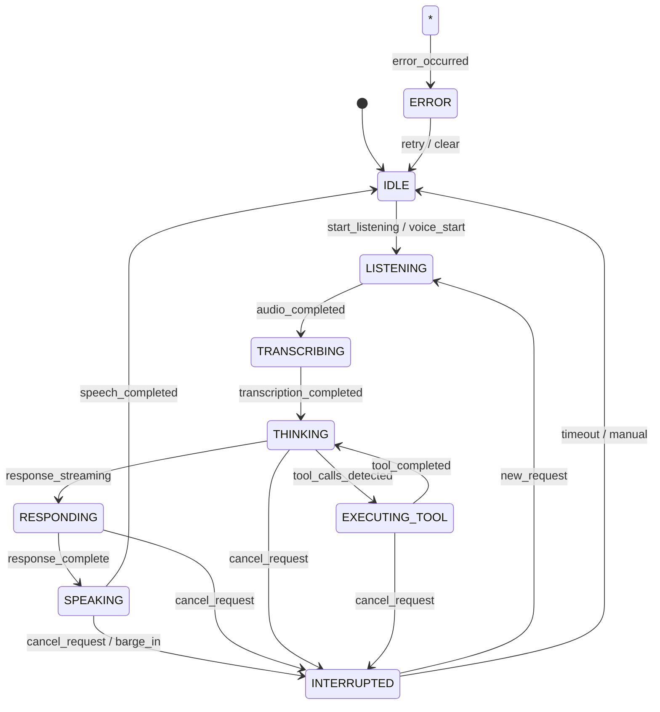

# Real-Time Architecture Documentation

This document describes the real-time architecture of the upgraded Voice Assistant, including the request lifecycle, interruption flow, WebSocket protocol, and state machine.

## Table of Contents

1. [Request Lifecycle](#request-lifecycle)
2. [Interruption Flow](#interruption-flow)
3. [WebSocket Protocol](#websocket-protocol)
4. [State Machine](#state-machine)
5. [Concurrency Safety](#concurrency-safety)
6. [Audio Pipeline](#audio-pipeline)

---

## Request Lifecycle

```
User
  ↓
Request ID created (UUID)
  ↓
Voice/Text input
  ↓
Processing
  ↓
Optional Tool Execution
  ↓
Streaming Response
  ↓
Speech
  ↓
Completed
```

### Detailed Flow

1. **Request Initiation**
   - User clicks microphone or types message
   - Frontend generates UUID `request_id`
   - Frontend sends `user_message` or `start_listening` with `request_id`

2. **Transcription (Voice Input)**
   - `transcription_started` event sent
   - Audio chunks streamed via `audio_chunk` events
   - VAD detects speech end → `audio_completed`
   - Backend transcribes → `transcription_completed`

3. **LLM Processing**
   - `thinking_started` event sent
   - LLM streams response chunks via `response_chunk`
   - If tool calls detected:
     - `tool_execution_started` for each tool
     - Tool executes with timeout
     - `tool_execution_completed` with result
     - LLM continues with tool results
   - `response_complete` when done

4. **Text-to-Speech**
   - `speech_started` event sent
   - TTS streams audio chunks via `speech_chunk`
   - `speech_completed` when done

5. **Completion**
   - State returns to `IDLE`
   - Request resources cleaned up

### Timing Metrics

Each request tracks:
- `request_started` → `request_completed` (total latency)
- `llm_first_token` latency
- `llm_completed` duration
- `tool_executed` per tool
- `tts_first_chunk` latency
- `tts_completed` duration

---

## Interruption Flow

```
Assistant Speaking
  ↓
User Speech Detected (VAD)
  ↓
Request Cancelled (cancel_request)
  ↓
Audio Stopped (Frontend + Backend)
  ↓
Old Events Invalidated (stale request_id)
  ↓
New Request Created (new request_id)
  ↓
Processing Resumes
```

### Detailed Flow

1. **Detection**
   - Frontend VAD detects user speech during `SPEAKING` state
   - Or user clicks stop button

2. **Cancellation Request**
   - Frontend calls `speech.stop()` to halt audio
   - Sends `cancel_request` with current `request_id`
   - Sets `activeRequestIdRef.current = null`

3. **Backend Cancellation**
   - Receives `cancel_request` 
   - Calls `manager.cancel_request(request_id)`
   - Cancels LLM streaming task
   - Cancels TTS generation task
   - Marks request as cancelled
   - Sends `request_cancelled` event

3. **State Transition**
   - State changes to `INTERRUPTED`
   - Frontend receives `request_cancelled`
   - Calls `handleInterruption()`:
     - Stops audio playback
     - Clears pending state
     - Resets `activeRequestIdRef`

4. **New Request**
   - User continues speaking or clicks microphone
   - New `request_id` generated
   - Normal request lifecycle begins

### Race Condition Handling

- **Stale Response Chunks**: Frontend checks `message.request_id === activeRequestIdRef.current` before processing
- **Late Speech Chunks**: Ignored if `request_id` doesn't match
- **Tool Results After Cancel**: Backend checks `manager.is_request_active(request_id)` before sending tool results
- **Audio Playback**: `useSpeechSynthesis` tracks `currentRequestIdRef`, skips stale audio

---

## WebSocket Protocol

### Event Structure

All events follow this structure:

```json
{
  "type": "event_name",
  "request_id": "uuid",
  "conversation_id": 1,
  "timestamp": "2024-01-15T10:30:00.000Z",
  "data": {}
}
```

### Client → Server Events

| Event | Description | Data Fields |
|-------|-------------|-------------|
| `user_message` | Text message from user | `content: string` |
| `audio_chunk` | Audio data chunk | `audio: base64` |
| `audio_completed` | End of audio stream | (none) |
| `start_listening` | Begin voice recording | (none) |
| `stop_speaking` | Stop assistant speech | (none) |
| `cancel_request` | Cancel current request | (none) |
| `new_conversation` | Create new conversation | (none) |
| `ping` | Keep-alive | (none) |

### Server → Client Events

| Event | Description | Data Fields |
|-------|-------------|-------------|
| `state_change` | Assistant state changed | `state: AssistantState` |
| `transcription_started` | STT began | (none) |
| `transcription_completed` | STT finished | `text: string, is_final: boolean` |
| `thinking_started` | LLM processing began | (none) |
| `tool_execution_started` | Tool execution began | `name: string, args: object` |
| `tool_execution_completed` | Tool finished | `name: string, result: any, error: string|null` |
| `response_chunk` | LLM response chunk | `content: string` |
| `response_complete` | LLM response done | (none) |
| `speech_started` | TTS began | (none) |
| `speech_chunk` | TTS audio chunk | `audio: base64` |
| `speech_completed` | TTS finished | (none) |
| `request_cancelled` | Request cancelled | `request_id: string` |
| `error` | Error occurred | `message: string, code: string` |
| `conversation_created` | New conversation | `conversation_id: number` |
| `pong` | Ping response | (none) |

### Error Codes

| Code | Description |
|------|-------------|
| `INVALID_FORMAT` | Message format invalid |
| `NOT_FOUND` | Conversation not found |
| `EMPTY_RESPONSE` | LLM returned empty response |
| `PROCESSING_ERROR` | Internal processing error |
| `SERVER_ERROR` | Unexpected server error |
| `TRANSCRIPTION_FAILED` | STT failed |
| `TTS_FAILED` | TTS generation failed |
| `TOOL_TIMEOUT` | Tool execution timed out |
| `TOOL_ERROR` | Tool execution failed |

---

## State Machine



### State Descriptions

| State | Description | User-Friendly Label |
|-------|-------------|---------------------|
| `IDLE` | Waiting for input | Ready |
| `LISTENING` | Recording audio | Listening |
| `TRANSCRIBING` | Converting speech to text | Transcribing |
| `THINKING` | LLM processing | Thinking |
| `EXECUTING_TOOL` | Running a tool | Using tool |
| `RESPONDING` | Streaming LLM response | Responding |
| `SPEAKING` | Playing TTS audio | Speaking |
| `INTERRUPTED` | Request cancelled | Interrupted |
| `ERROR` | Error occurred | Error |

### Valid Transitions

| From | To | Trigger |
|------|-----|---------|
| IDLE | LISTENING | User starts voice input |
| IDLE | THINKING | User sends text message |
| LISTENING | TRANSCRIBING | Audio recording completes |
| LISTENING | IDLE | User cancels recording |
| TRANSCRIBING | THINKING | Transcription complete |
| TRANSCRIBING | ERROR | STT failure |
| THINKING | EXECUTING_TOOL | LLM requests tool |
| THINKING | RESPONDING | LLM streams response |
| THINKING | INTERRUPTED | Cancel request |
| THINKING | ERROR | LLM failure |
| EXECUTING_TOOL | THINKING | Tool result received |
| EXECUTING_TOOL | INTERRUPTED | Cancel request |
| EXECUTING_TOOL | ERROR | Tool failure |
| RESPONDING | SPEAKING | Response complete |
| RESPONDING | INTERRUPTED | Cancel request |
| SPEAKING | IDLE | Speech complete |
| SPEAKING | INTERRUPTED | Barge-in / cancel |
| INTERRUPTED | LISTENING | New voice input |
| INTERRUPTED | IDLE | Timeout / manual |
| ERROR | IDLE | User retry |

---

## Concurrency Safety

### Request Lifecycle Guards

**Backend**
- `ConnectionManager` tracks active requests per conversation
- `manager.is_request_active(request_id)` checked before sending events
- Cancelled requests removed from active set
- `asyncio.Lock` protects shared state

**Frontend**
- `activeRequestIdRef` tracks current request
- All event handlers verify `message.request_id === activeRequestIdRef.current`
- `useSpeechSynthesis` tracks `currentRequestIdRef`, skips stale audio
- Queue cleared on interruption

### Race Condition Scenarios

| Scenario | Protection |
|----------|------------|
| User sends request A, then quickly request B | Request B gets new `request_id`; A's events ignored |
| Assistant speaking, user interrupts | `cancel_request` sent; stale `speech_chunk` ignored |
| Tool executing, user cancels | Backend checks `is_request_active` before sending tool result |
| WebSocket reconnects mid-request | Old `request_id` invalidated; new request started |
| Multiple `response_chunk` events | All checked against active `request_id` |

### Connection Management

- Exponential backoff reconnection (1s, 2s, 4s, 8s, 16s, max 30s)
- Max 5 reconnection attempts
- `onReconnect` callback for state recovery
- Ping/pong every 30s for keep-alive

---

## Audio Pipeline

### Frontend Audio Capture

```
Microphone → MediaRecorder (WebM/Opus) → AudioContext (VAD)
    ↓
onDataAvailable → base64 → WebSocket (audio_chunk)
    ↓
Audio level visualization (AnalyserNode)
    ↓
VAD: threshold + silence_duration → auto audio_completed
```

### VAD Configuration

```typescript
const vadThreshold = 0.02;        // Audio level 0-1
const silenceDurationMs = 1500;   // ms of silence before stop
```

### Frontend Audio Playback

```
WebSocket (speech_chunk base64)
    ↓
base64ToBlob(audio/mpeg)
    ↓
Audio queue (sequential playback)
    ↓
HTMLAudioElement.play()
    ↓
onended → next chunk
    ↓
Interruption: stop() → clear queue → resolve all
```

### Audio Cancellation

1. **Frontend**: `speech.stop()` → pauses audio, clears queue, resolves promises
2. **Backend**: `manager.cancel_request()` → cancels TTS task
3. **Request ID**: New `request_id` invalidates in-flight audio chunks

### TTS Streaming

- OpenAI TTS supports streaming via `stream_synthesize()`
- Audio chunks sent as `speech_chunk` events
- Fallback to non-streaming if streaming fails
- First chunk latency tracked for metrics

---

## Error Handling

### WebSocket Errors

- Invalid format → `INVALID_FORMAT` error, continue listening
- Connection lost → auto-reconnect with exponential backoff
- Max retries exceeded → show error, allow manual retry

### Processing Errors

- STT failure → `TRANSCRIPTION_FAILED` error, fallback to REST API
- LLM failure → `PROCESSING_ERROR` error, return to IDLE
- TTS failure → fallback to non-streaming, then `TTS_FAILED` error
- Tool timeout → `TOOL_TIMEOUT` error, continue without tool

### Recovery

- All errors transition to `ERROR` state
- Auto-return to `IDLE` after 3 seconds
- User can retry with new request
- Conversation history preserved

---

## Performance Considerations

### Latency Optimization

- TTS streaming reduces time-to-first-audio
- LLM streaming reduces time-to-first-token
- Parallel tool execution (when multiple tools called)
- Connection reuse (single WebSocket per conversation)

### Memory Management

- Audio chunks not buffered on backend (streamed)
- Frontend audio queue cleared on interruption
- Request context cleaned up after completion
- WebSocket connections pooled per conversation

### Scalability

- Stateless backend (except active requests)
- Redis-ready for distributed deployments
- Connection manager can be sharded by conversation_id